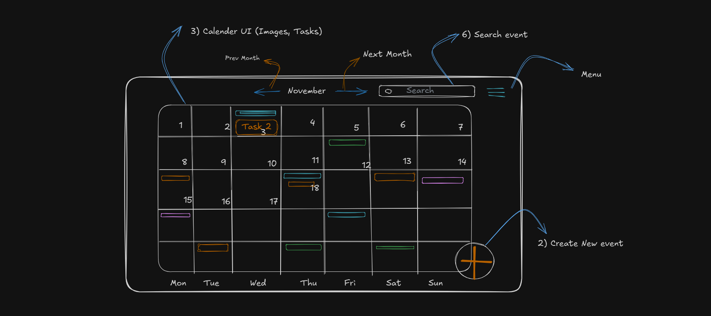
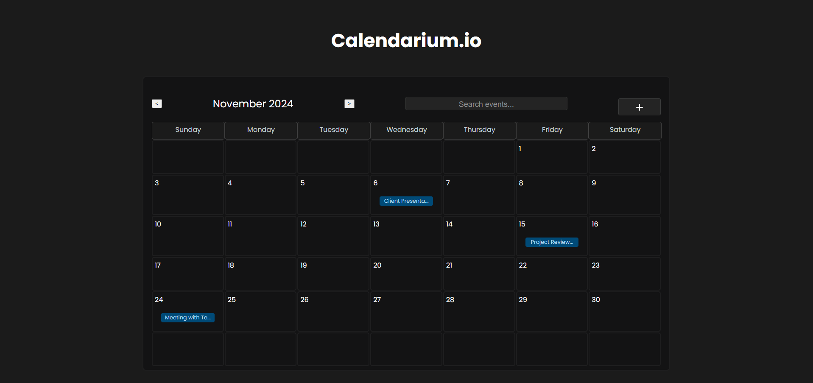

# Calendarium.io

Prototype:

Output:


# Calendarium.io - A Fullstack App Built with Next.js and NestJS

**Calendarium.io** is a full-stack web application built using **Next.js** for the frontend and **NestJS** for the backend. It provides a comprehensive calendar solution for managing events, appointments, and schedules.

## Project Setup

To run the project on your local machine, follow these steps:

### Frontend (Next.js)

1. **Clone the repository**:
```
git clone https://github.com/your-username/calendarium.git
```

2. **Navigate to the frontend directory**:
```
cd calendarium/frontend
```

3. **Install dependencies**:
```
npm install
```

4. **Start the development server**:
```
npm run dev
```

This will start the Next.js development server and you can access the frontend at `http://localhost:3000`.

### Backend (NestJS)

1. **Navigate to the backend directory**:
```
cd calendarium/backend
```

2. **Install dependencies**:
```
npm install
```

3. **Start the development server**:
```
npm run start:dev
```

This will start the NestJS development server and you can access the backend API at `http://localhost:3001`.

## Project Structure

The project is organized as follows:

<span style="color:blue">**frontend**</span>
- <span style="color:blue">**pages**</span>
  - <span style="color:blue">index.tsx</span>
  - <span style="color:blue">calendar.tsx</span>
  - <span style="color:blue">settings.tsx</span>
- <span style="color:blue">**components**</span>
  - <span style="color:blue">Calendar.tsx</span>
  - <span style="color:blue">EventForm.tsx</span>
  - <span style="color:blue">UserSettings.tsx</span>
- <span style="color:blue">**styles**</span>
  - <span style="color:blue">globals.css</span>
- <span style="color:blue">**utils**</span>
  - <span style="color:blue">api.ts</span>

<span style="color:blue">**backend**</span>
- <span style="color:blue">**src**</span>
  - <span style="color:blue">**modules**</span>
    - <span style="color:blue">events</span>
    - <span style="color:blue">users</span>
  - <span style="color:blue">**controllers**</span>
    - <span style="color:blue">EventsController.ts</span>
    - <span style="color:blue">UsersController.ts</span>
  - <span style="color:blue">**services**</span>
    - <span style="color:blue">EventsService.ts</span>
    - <span style="color:blue">UsersService.ts</span>
  - <span style="color:blue">**entities**</span>
    - <span style="color:blue">Event.ts</span>
    - <span style="color:blue">User.ts</span>
  - <span style="color:blue">**app.module.ts**</span>
  - <span style="color:blue">**main.ts**</span>

## Technologies Used

- **Frontend**:
  - [Next.js](https://nextjs.org/) - React framework for building server-rendered applications
  - [Axios](https://axios-http.com/) - HTTP client for making API requests
  - [Tailwind CSS](https://tailwindcss.com/) - Utility-first CSS framework

- **Backend**:
  - [NestJS](https://nestjs.com/) - A progressive Node.js framework for building efficient, scalable, and enterprise-grade server-side applications
  - [TypeORM](https://typeorm.io/) - Object-Relational Mapping (ORM) library for TypeScript and JavaScript

## Features

- User authentication and authorization
- CRUD operations for events
- Calendar view with day, week, and month modes
- Shareable calendars and event invitations
- Integration between frontend and backend

## Contributing

If you'd like to contribute to this project, please follow these steps:

1. Fork the repository
2. Create a new branch for your feature/bug fix
3. Implement your changes
4. Test your changes
5. Submit a pull request
